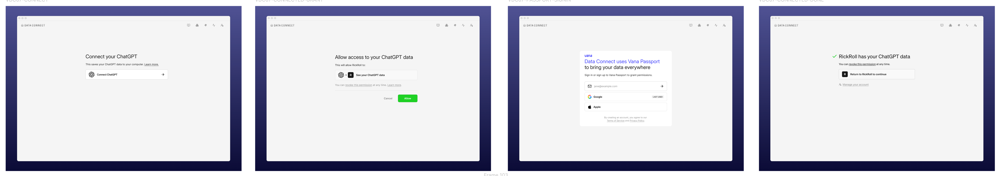

# Connection Flow UI placement + triggers

## Context

- Current entry point: `Home` → `handleExport` → `startExport` → `invoke('start_connector_run')`.
- `start_connector_run` starts Playwright (runtime: `playwright`) or opens an external webview to `connectURL`.
- There is no in-app multi-screen flow today; only `Home` cards + `Runs` status UI exist.

## Goal

Add in-app connection UI screens (per screenshots) without breaking the current runner/webview system.

## UI reference

## Proposed placement

Create a dedicated route + page:

- Route: `/connect/:platformId`
- Page: `src/pages/ConnectFlow.tsx`
- Triggered from `Home` instead of calling `startExport` directly.

## Proposed trigger wiring (minimal change)

1. `Home` “Connect [Platform]” card → `navigate("/connect/<platformId>")`.
2. `ConnectFlow` renders UI steps.
3. “Continue” / “Allow” button in `ConnectFlow` calls `startExport(platform)`.
4. Backend behavior unchanged: Playwright/webview still handles actual browser login.
5. After completion, navigate to `/runs` or back to `/`.

## Screen mapping (per screenshots)

- Step 1: “Connect your X” → `ConnectFlow` step 1.
- Step 2: “Allow access” → `ConnectFlow` step 2.
- Step 3: “Vana Passport sign-in” → either:
  - new `ConnectFlow` step, or
  - reuse `GrantFlow` with a handoff (if consistent with app-auth flows).
- Step 4: “Success” → `ConnectFlow` completion → route to `/runs` or `/`.

## Alternative (heavier)

Replace the external webview with an embedded browser in React/Tauri.

- Not currently implemented in this codebase.
- Requires new backend plumbing; higher risk/scope.

## Decisions needed tomorrow

- Do we keep external webview/Playwright and just wrap it with new UI?
- Should step 3 reuse `GrantFlow` or be a standalone screen?
- After success: return to `/runs` or back to `/`?
