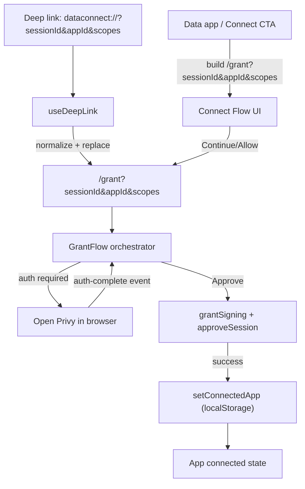

# Grant + Connect Flow

## Purpose

Explain how connect UI, deep links, and the grant flow fit together so the system
is predictable, debuggable, and easy to extend.

## Flow diagram

## Responsibilities

- Connect Flow UI: presents the multi-step UI and sends the user into the grant flow.
- Grant Flow: owns auth/consent/signing states and persists the connected app.
- Deep links: normalize to canonical `/grant` URL params, then route with `replace`.
- App registry: defines available apps, default app, and scopes for demo usage.

## Canonical inputs

Grant flow inputs are canonical in the URL:

- `sessionId`
- `appId`
- `scopes` (JSON array or comma-delimited fallback)

Do not use `location.state` for these values.

## Demo behavior (local)

Demo sessions (`sessionId` starts with `grant-session-`) use registry metadata and
skip relay calls. If `appId` is missing, the default app is used.

## Where to look

- URL parsing/building: `src/lib/grant-params.ts`
- Deep links: `src/hooks/useDeepLink.ts`
- Grant flow state machine: `src/pages/grant-flow/use-grant-flow.ts`
- Grant flow UI: `src/pages/grant-flow/*`
- App registry + default: `src/apps/registry.ts`
