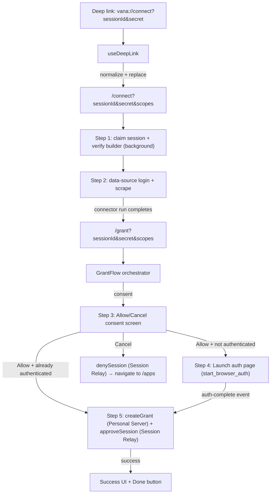

# Grant + Connect Flow

## Purpose

Explain how connect UI, data-source login/scrape, deep links, and the grant flow
fit together so the system is predictable, debuggable, and easy to extend.

## Flow diagram



## Key architectural principle: consent before sign-in

Session claim data (`granteeAddress`, `scopes`, builder manifest) is held in app
state throughout the flow. The user sees what data will be shared and consents
**before** being asked to sign in. Sign-in is deferred until grant creation time —
the only step that actually requires a wallet and the Personal Server's derived
keypair. If the user is already signed in, the auth screen is skipped automatically.

## Screen flow

```
Screen 1: "Connect your ChatGPT"     ← deep link landing, background claim + verify
Screen 2: Browser scraping            ← user exports their data
Screen 3: "Allow access" (consent)    ← user approves scopes
Screen 4: "Sign in" (deferred auth)   ← only if not already signed in
Screen 5: "Connected" (success)       ← grant creation + session approve + confirmation
```

## Responsibilities

- **Connect page** (`/connect`): Parses deep link params, runs background session
  claim + builder verification (pre-fetch), starts data-source login/scrape, then
  navigates to `/grant` with pre-fetched data in `location.state`.
- **Grant page** (`/grant`): Owns consent/auth/grant-creation/success states. Receives
  pre-fetched session + builder manifest via navigation state to skip re-fetching.
- **Session Relay**: Coordinates between builder app and dataConnect. Endpoints:
  `POST /v1/session/claim`, `POST /v1/session/{id}/approve`, `POST /v1/session/{id}/deny`.
- **Personal Server**: Signs and submits grants to Gateway. `POST /v1/grants` creates
  an EIP-712 signed grant; `GET /v1/grants` lists grants; `DELETE /v1/grants/{grantId}` revokes.
- **Builder verification**: Gateway lookup (`GET /v1/builders/{address}`) + W3C manifest
  fetch + EIP-191 signature verification. Fatal on failure per protocol spec.
- **Auth page**: `src/auth-page`, launched via Tauri, posts `/auth-callback`.
- **Deep links**: Normalize `vana://connect` URLs to canonical params, route to `/connect`.

## Canonical inputs

Grant flow inputs are canonical in the URL:

- `sessionId` — session identifier from Session Relay
- `secret` — authorization secret from deep link (threaded through claim/approve/deny)
- `scopes` (JSON array or comma-delimited fallback)
- `status` (optional, `success` forces success UI)

Pre-fetched data (`session` + `builderManifest`) is passed via `location.state`
from `/connect` to `/grant` as an optimization — not a canonical input.

## State machine

```
loading → claiming → verifying-builder → consent → auth-required → creating-grant → approving → success
                                                        │
                                                   (skipped if
                                                    already
                                                    signed in)
```

The `exporting` phase happens on the `/connect` route (Screen 1-2), not in the
grant flow state machine. The grant page starts at `consent` when pre-fetched
data is available.

## Connected apps

Gateway is the source of truth for connected apps. `useConnectedApps` fetches
grants from Personal Server `GET /v1/grants` (which proxies Gateway), filters
out revoked grants, and derives display names from scope labels. Revocation calls
`DELETE /v1/grants/{grantId}` with optimistic Redux update + rollback on failure.

## Split-failure recovery

If `POST /v1/grants` succeeds but `POST /v1/session/{id}/approve` fails, the
grant exists on Gateway but the builder never learns about it. `usePendingApproval`
persists the pending approval in localStorage and retries once on next app startup.

## Demo behavior (local)

Demo sessions (`sessionId` starts with `grant-session-`) use mock metadata and
skip relay/builder/personal-server calls. Gated behind `import.meta.env.DEV`.

## Where to look

- URL parsing/building: `src/lib/grant-params.ts`
- Deep links: `src/hooks/use-deep-link.ts`
- Grant flow state machine: `src/pages/grant/use-grant-flow.ts`
- Grant flow UI: `src/pages/grant/*`
- Consent screen: `src/pages/grant/components/consent/grant-consent-state.tsx`
- Connect page (step 1): `src/pages/connect/index.tsx`
- Session Relay client: `src/services/sessionRelay.ts`
- Personal Server client: `src/services/personalServer.ts`
- Builder verification: `src/services/builder.ts`
- Connected apps: `src/hooks/useConnectedApps.ts`
- Pending approval recovery: `src/hooks/usePendingApproval.ts`
- Scope labels: `src/lib/scope-labels.ts`
- Storage (pending approvals only): `src/lib/storage.ts`
