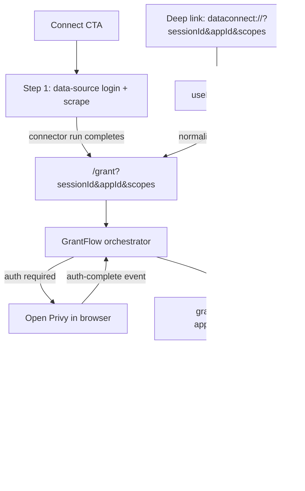

# Grant + Connect Flow

## Purpose

Explain how connect UI, data-source login/scrape, deep links, and the grant flow
fit together so the system is predictable, debuggable, and easy to extend.

## Flow diagram

## UI design reference

Linear 4-step connect/grant design: `docs/_wip/260202-connect-flow.png`.

## Responsibilities

- Connect Flow UI: presents the multi-step UI, starts data-source login/scrape,
  then routes into the grant flow.
- Data-source login/scrape: connector run launched from step 1.
- Grant Flow: owns consent/auth/signing states and persists the connected app.
- Deep links: normalize to canonical `/grant` URL params, then route with `replace`.
- App registry: defines available apps, default app, and scopes for demo usage.

## Current implementation status

- `src/pages/grant/*` covers consent/auth/success states only (steps 2-4).
- Step 1 (data-source login + scrape) is not implemented in the grant flow.
- Demo app routing: `/apps/:appId` renders a host page (e.g. `src/pages/RickRollApp.tsx`)
  that handles gating + grant CTA, and then renders the app UI from
  `src/apps/<appId>/app.tsx` once connected.

## Canonical inputs

Grant flow inputs are canonical in the URL:

- `sessionId`
- `appId`
- `scopes` (JSON array or comma-delimited fallback)

Do not use `location.state` for these values.

## React state stability

- In `useGrantFlow`, the `scopes` dependency uses a stable key (`scopes.join("|")`) to
  avoid re-running effects on new array identities.

## Demo behavior (local)

Demo sessions (`sessionId` starts with `grant-session-`) use registry metadata and
skip relay calls. If `appId` is missing, the default app is used.

## Where to look

- URL parsing/building: `src/lib/grant-params.ts`
- Deep links: `src/hooks/useDeepLink.ts`
- Grant flow state machine: `src/pages/grant/use-grant-flow.ts`
- Grant flow UI: `src/pages/grant/*`
- App registry + default: `src/apps/registry.ts`
- Connector run entrypoint: `src/hooks/useConnector.ts` + `start_connector_run`
