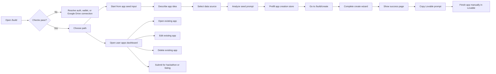
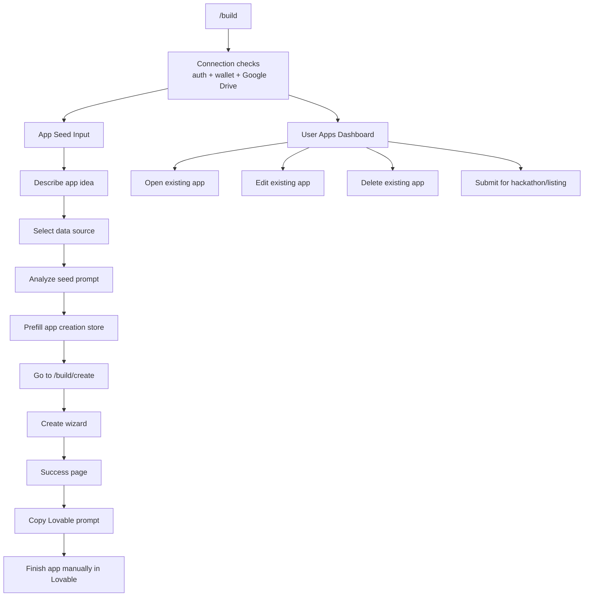
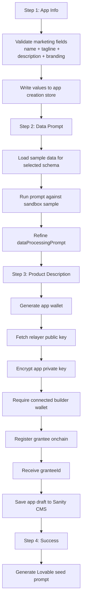
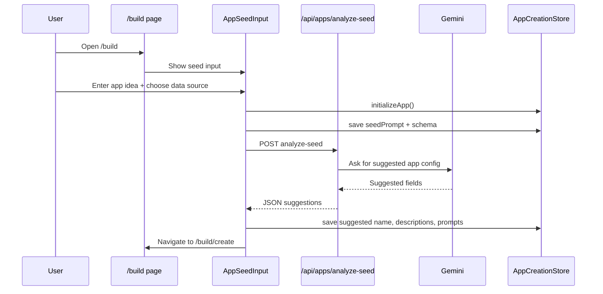
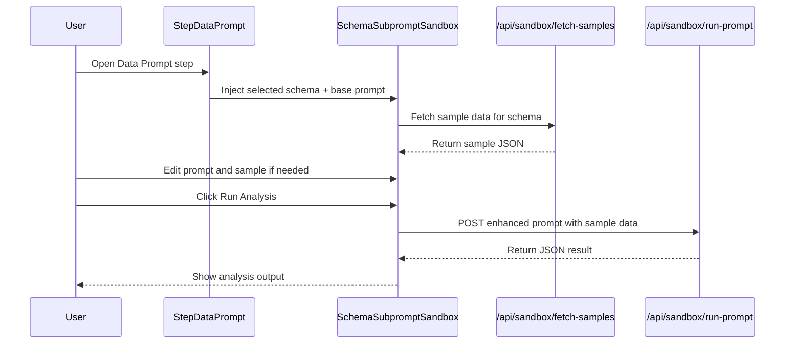
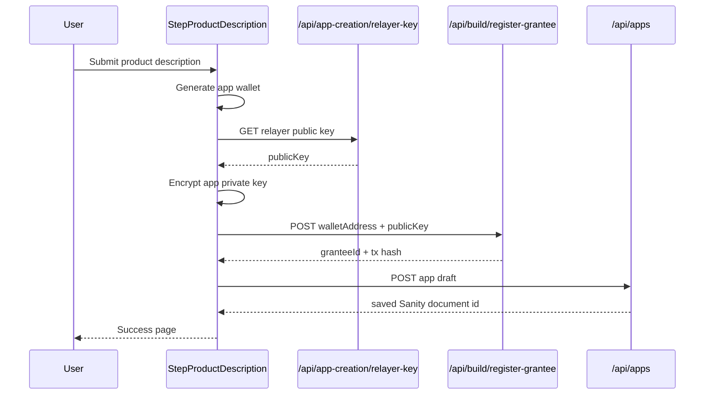
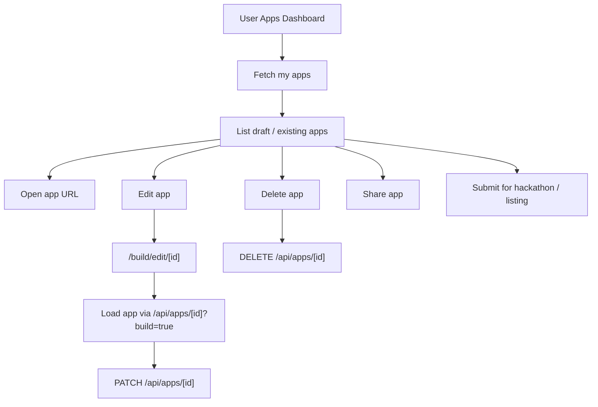

# Builder Flow Diagrams

This document breaks the builder workflow into smaller Mermaid diagrams.
The goal is readability first, not completeness in a single canvas.

## 0. FigJam-Friendly Overview

## 1. High-Level Builder Flow

## 2. App Creation Wizard

## 3. Seed Analysis + Prefill

## 4. Prompt Sandbox Flow

## 5. Onchain Registration + Save

## 6. Existing Apps Flow

## Notes

- The current live flow chooses the data source in the seed input on `/build`.
- There is a `step-data-source.tsx` file in the repo, but it is not wired into the current wizard steps.
- The success page does not fully publish the app. It hands off to Lovable for the final manual build/publish flow.
