# Data Connect UI Reference

Design mockups for the Data Connect desktop application.

## App Structure

- **Header**: "DATA CONNECT" logo with navigation icons (Your Data, Apps, MCP, Trace, Account)
- **Style**: Clean, minimal design with light gray background and white cards

---

## Data Collection Flow

### 1. Connect Source (Home Screen)
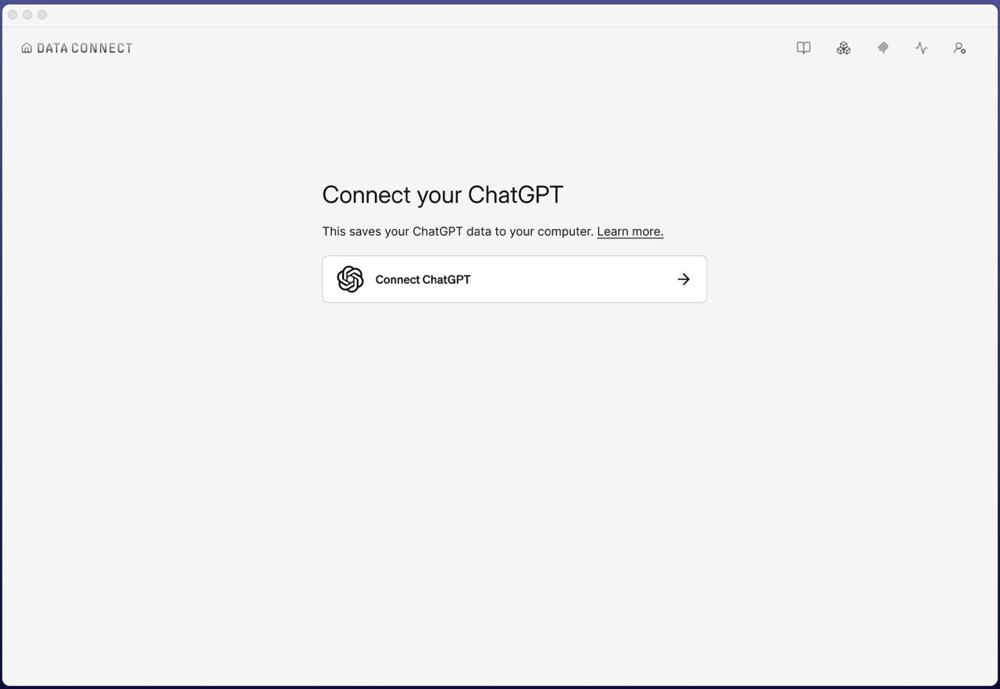

First screen users see - prompt to connect a data source (e.g., ChatGPT).

### 2. Platform Login
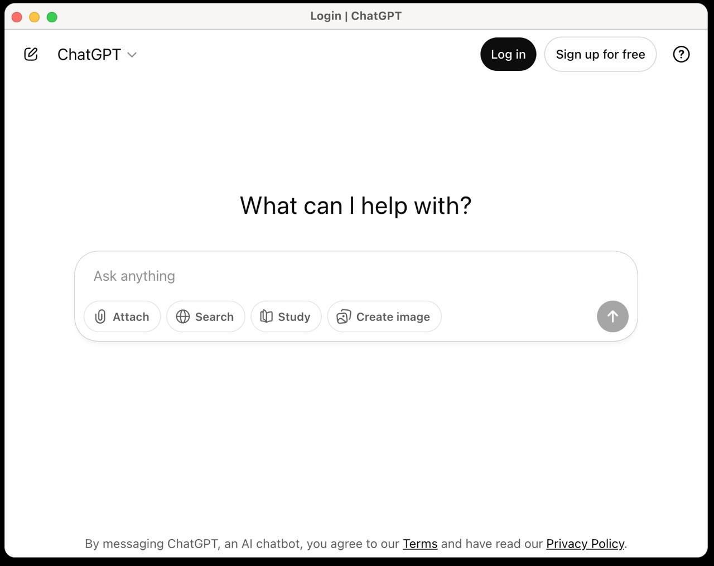

Automated browser opens for user to authenticate with the platform.

---

## Builder Grant Flow

When a third-party app requests access to user data:

### 1. Vana Passport Login
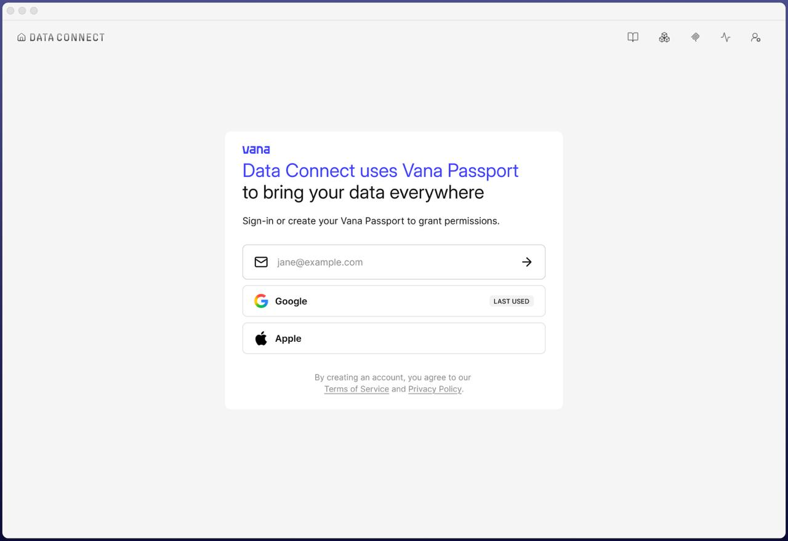

User authenticates via Vana Passport (email or Google). Implemented using Privy - see reference: `read-only-for-reference/vault/components/auth/`

### 2. Grant Permission
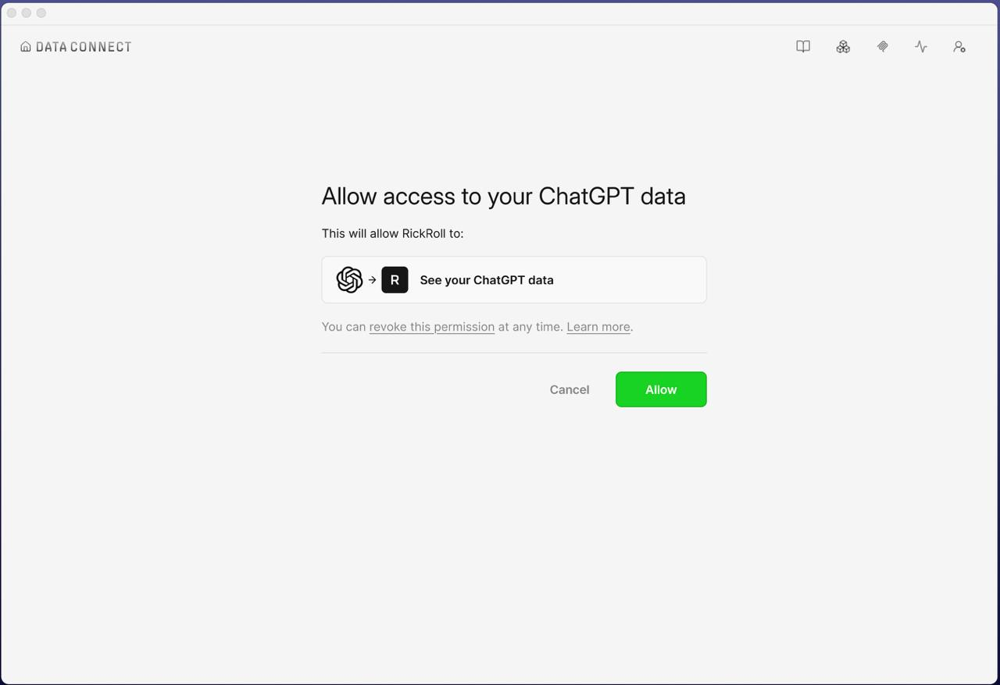

Consent screen showing which app (e.g., "RickRoll") will access the data. Cancel/Allow actions.

### 3. Confirmation

Success state with option to return to the requesting app.

---

## Your Data

### Data Sources Tab
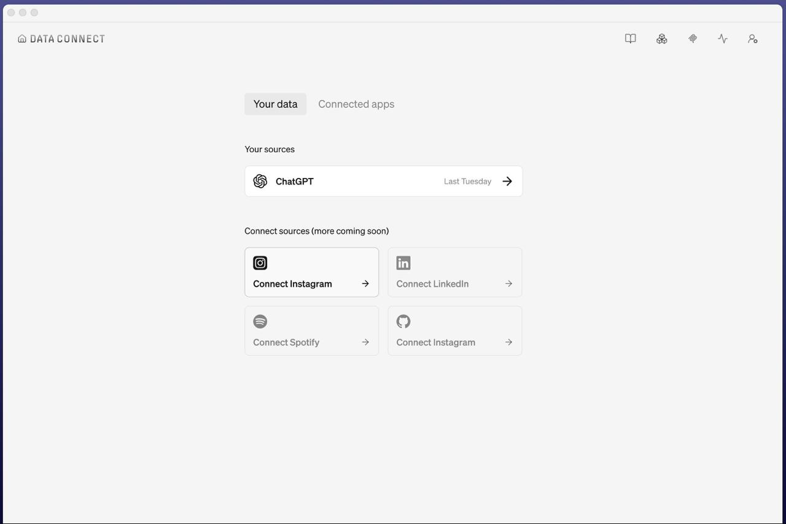

- **Your sources**: List of connected platforms (ChatGPT, etc.) with last sync date
- **Connect sources**: Cards for Instagram, LinkedIn, Spotify, GitHub

### Connected Apps Tab
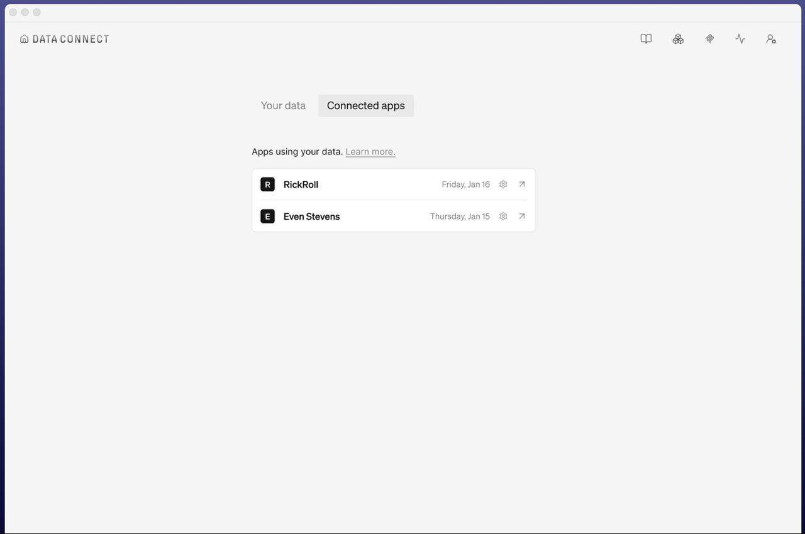

List of third-party apps using your data with grant dates and settings.

---

## Settings

### Account
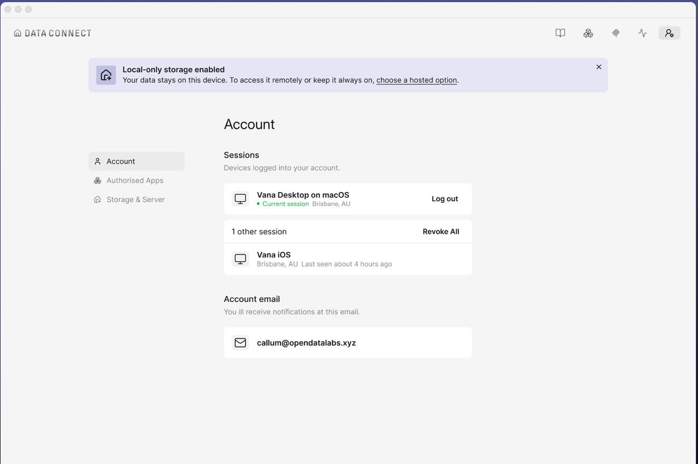

- Banner: "Local-only storage enabled" with option to choose hosted storage
- **Sessions**: Active devices (Desktop, iOS) with logout/revoke options
- **Account email**: User's email address

### Authorised Apps
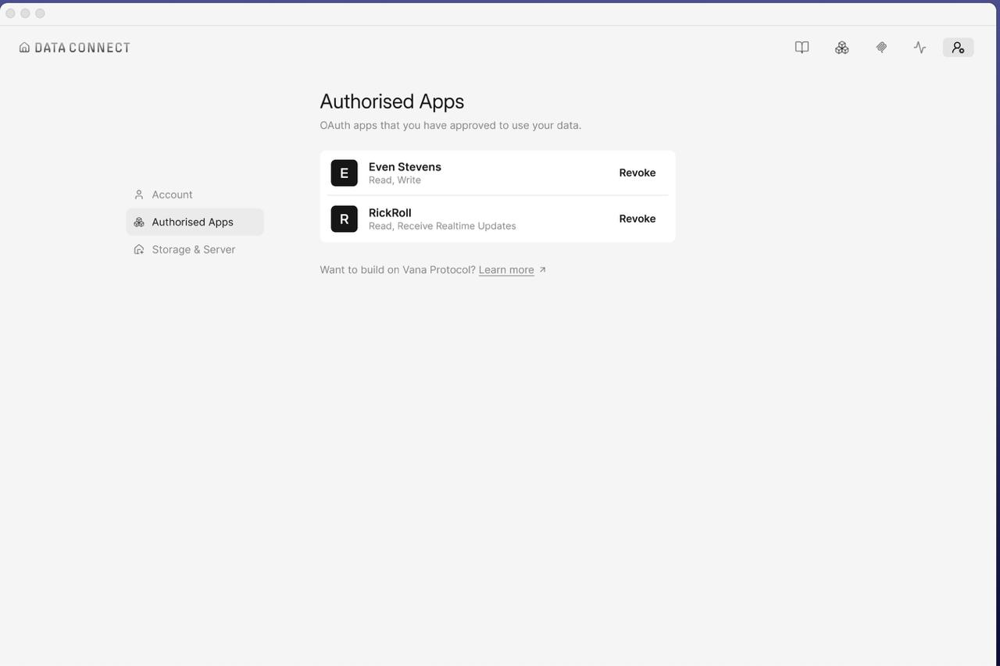

OAuth apps with granted permissions (Read, Write, Realtime Updates) and Revoke buttons.

### Storage & Server
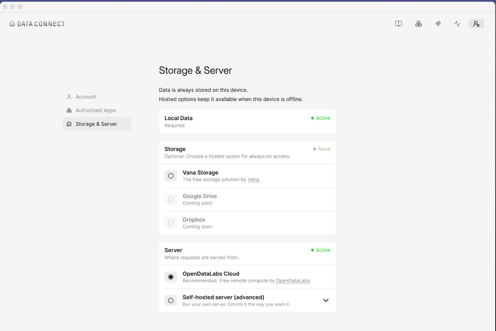
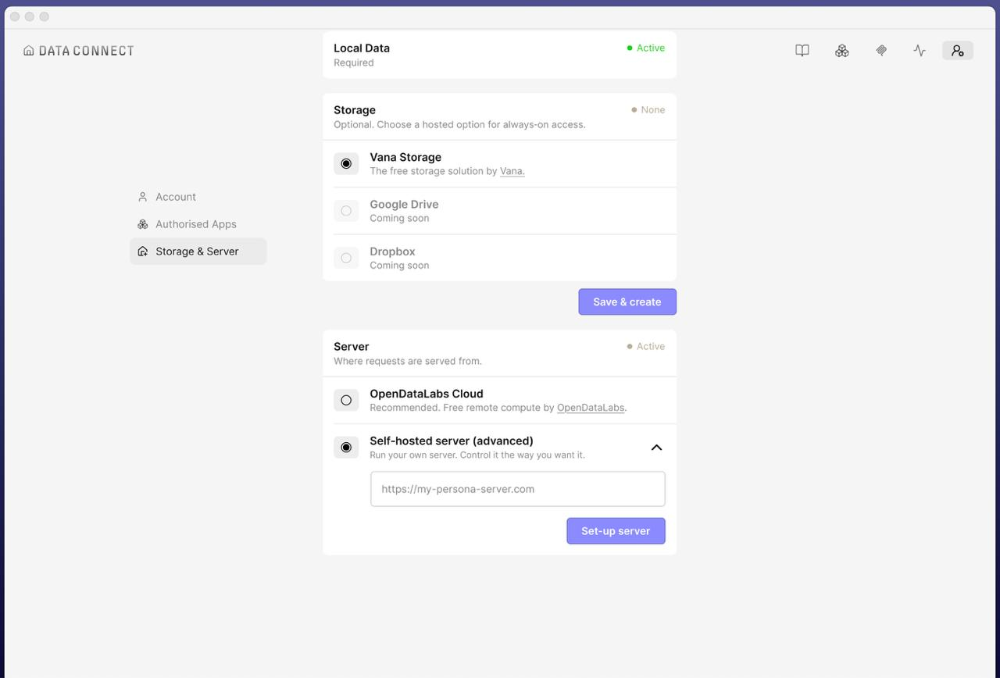
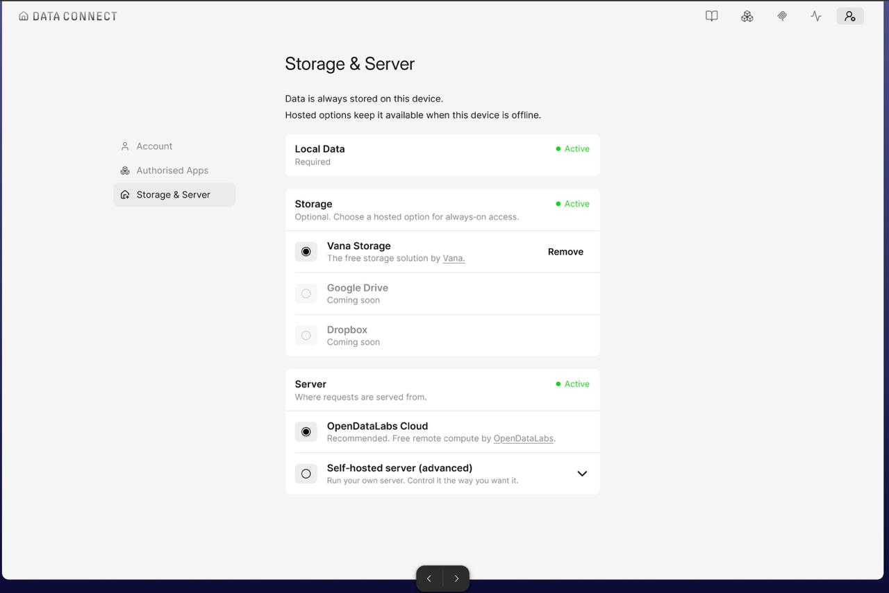

**Local Data** (Required, always active)

**Storage** (Optional):
- Vana Storage (free)
- Google Drive (coming soon)
- Dropbox (coming soon)

**Server**:
- OpenDataLabs Cloud (recommended)
- Self-hosted server (advanced) - accepts custom URL

---

## MCP Integration
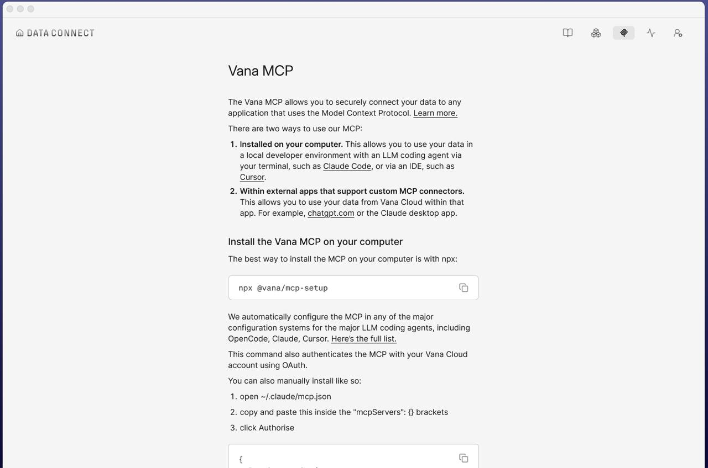

Instructions for connecting Vana MCP to AI tools (Claude Code, Cursor, etc.):
- Install via `npx @vana/mcp-setup`
- Manual config for `~/.claude/mcp.json`

---

## Data Apps Marketplace
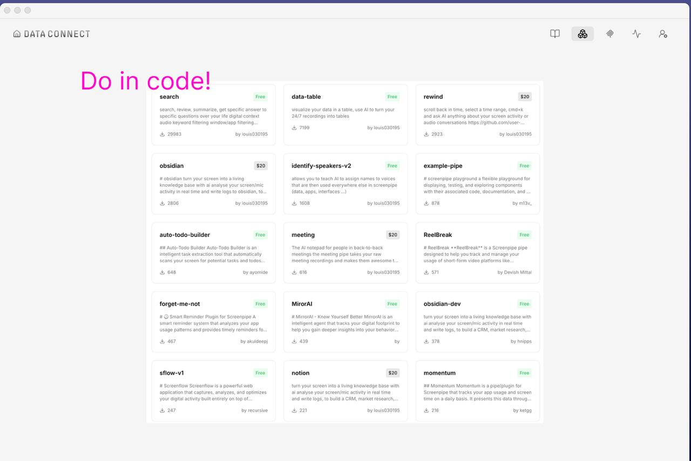

Grid of apps/plugins that use your data (search, data-table, rewind, obsidian, etc.) with pricing (Free/$20) and download counts.
